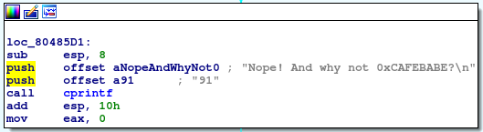
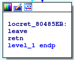
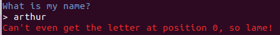
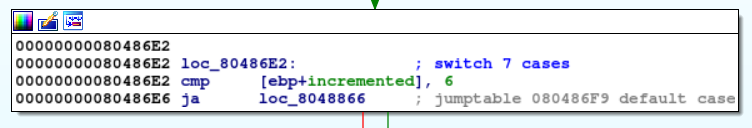
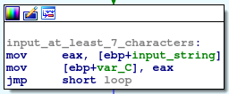
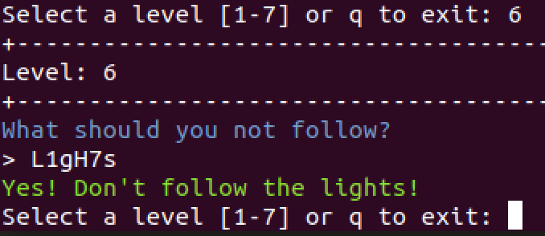
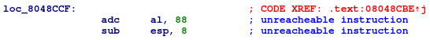

# Gollum

> * CATRISSE Arthur
> * DAGERI Kaan
> * DALBOUSSIERE Hugo

# Level 1

Le premier niveau nous demande d'entrer un nombre :


Etudions le premier bloc.


On push l'entrée utilisateur dans la stack afin d'appeller la fonction atoi.  
Cette fonction convertis la string en un int.
On récupère le résultat de eax et on le déplace dans l'adresse ebp+var_C puis on compare cette valeur à 501337h ou encore 5247799 en décimal.  
Si cela ne corresponds pas (jump if not zero) on saute vers le bloc suivant qui affichera un message d'erreur puis quittera la fonction level_1 :



Sinon, l'entrée utilisateur corresponds (le zero flag est à 1) et l'on saute sur le bloc suivant qui affiche un message de succès en vert :


On mets aussi 1 dans eax pour indiquer la bonne terminaison de la fonction.  
Enfin, on arrive au dernier bloc qui ne fait que retourner à la fonction appellante.  



Le flag est donc **5247799**.

# Level 2

Le second niveau nous demande d'entrer un mot de passe :


Etudions le premier bloc.


On peut voir qu'une longue chaîne de caractères est stockée à l'adresse ebp+long_text et est poussée dans la stack.  
Aussi, sa longueur est stockée à l'adresse ebp+long_text_length.  
L'entrée utilisateur est stockée à l'adresse ebp+user_input et sa longueur est stockée à l'adresse ebp+user_input_length.  
Enfin deux compteurs sont initialisés et stockés :  
counter_1 à 0 dans l'adresse ebp+counter_1  
counter_2 à 256 dans l'adresse ebp+counter_2   


Dans le bloc suivant, on aperçoit un jump conditionnel qui est valide uniquement lorsque la longueur de long_text est inférieure à la valeur de counter_2.  
Si la condition est validée, le bloc suivant affichera un message de succès en vert puis quittera la fonction level_2 :  


Sinon, on continue dans un bloc qui semble être une boucle :  


Cette boucle déplace les pointeurs des chaînes de caractères user_input et long_text en fonction des valeurs de counter_1 et counter_2.  
counter_1 s'incrémentant toujours de 1, le pointeur de user_input se déplacera de 1 charactère.  
counter_2 s'incrémentant toujours de 5, le pointeur de long_text se déplacera de 5 charactères.  
Attention, il faut prendre en compte que counter_2 a été initialisé à la valeur 256.  
Enfin, on récupères les premiers charactères de user_input et de long_text puis on les compare pour voir s'ils sont identiques.  

S'ils ne sont pas identiques, le bloc suivant affichera un message d'erreur en rouge puis quittera la fonction level_2 :  

  

S'ils sont identiques, on passe au bloc suivant qui va incrémenter les compteurs :  


Après l'incrémentation des compteurs, on revient dans la boucle pour tester les prochains charactères.

Suite à ces observations, on peut déduire que le flag à trouver commence au charactère 256 de la chaîne de caractères long_text et contiendra toutes les lettres qui se situent par incrément de 5 plus loin, jusqu'à ce que l'on sorte de long_text.  
Le counter_1 ne sert qu'à itérer sur l'entrée de l'utilisateur.  
On peut faire un script Python simpliste qui implémente ce comportement :  

```python
mysterious_string = "AAA%AAsAABAA$AAnAACAA-AA(AADAA;AA)AAEAAaAA0AAFAAbAA1AAGAAcAA2AAHAAdAA3AAIAAeAA4AAJAAfAA5AAKAAgAA6AALAAhAA7AAMAAiAA8AANAAjAA9AAOAAkAAPAAlAAQAAmAARAAoAASAApAATAAqAAUAArAAVAAtAAWAAuAAXAAvAAYAAwAAZAAxAAyAAzA%%A%sA%BA%$A%nA%CA%-A%(A%DA%;A%)A%EA%aA%0A%FA%bA%1A%GcA%cAa%2A%vHA%deA%3Af%IA%ieA%4sA%JAh%fA%a5A%KnA%gAd%6A%gLA%hoA%7Ab%MA%liA%8iA%NAn"

index = 256
done = False
flag = ''

while not done:
    if len(mysterious_string) >= index:
        flag += mysterious_string[index]
        index += 5
    else:
        done = True

print "The flag is " + flag
```
On trouve alors le mot de passe en clair : **cavefishandgoblin**

# Level 3

En premier lieu, on teste le lvl 3, et on parvient à obtenir 2 messages d’erreur différents. Le premier lorsqu’on écrit quelque chose, et le deuxième lorsqu’on tape entrer sans rien écrire.




Une fois dans IDA, après avoir remarqué que le schéma représentant le code de lvl_3 était très étendu en largeur, nous avons choisi d’analyser en premier les blocs du bas. Il y a 2 blocs vers lesquels arrivent tous les autres.
Sur celui-ci, qui est situé au milieu en bas, on constate un return avec l’instruction « retn ». C’est donc le bloc qui terminera le programme. On renomme ce bloc en « end : ».


Sur le deuxième bloc situé en bas (à gauche), la seule instruction effectuée est celle de rajouter 1 à une valeur située dans une case mémoire, puis de reboucler vers un bloc situé bien plus haut. C’est donc une instruction d’incrémentation. On renomme donc le bloc en « increment : » et la case mémoire en « [ebp+incremented] ».


En remontant les blocs d’un niveau vers le haut, on différentie 2 types de blocs. Les premiers affichent un message, en appelant la fonction cprintf. Le message est stocké en tant que chaine de caractères grâce à « db ». Parmi les messages qui existent, on retrouve les 2 sur lesquels on était tombés en testant le programme. Après avoir affiché le message, le bloc d’instructions effectue un jump au bloc que nous avons renommé « end » pour terminer le process. Le deuxième type de bloc ne fait rien mis à part un jmp au bloc que nous avons renommé « increment ».
On va maintenant remonter en haut des blocs.
Le bloc tout en haut est celui qui est appelé lorsqu’on choisit le niveau 3. On sait que c’est dans ce bloc que le code teste la présence ou l’absence de lettres entrées par l’utilisateur, puisque le jump conditionnel peut aller directement au bloc de message d’erreur que l’on reçoit lorsqu’on ne rentre aucun caractère avant de valider.
Dans le cas où des caractères sont rentrés, on tombe sur un petit bloc d’instructions qui initialise à 0 la valeur de [ebp+incremental] grâce à l’instruction mov.


Ensuite, le bloc jump jusqu’à un autre bloc, le même que celui vers lequel le bloc d’incrémentation retourne. C’est donc le bloc de départ d’une boucle. La sortie de cette boucle s’effectue uniquement lorsque le joueur a trouvé la solution, donc lorsque le programme a itéré à travers toutes les lettres rentrées sans être tombé sur un message d’erreur (et donc être sorti du programme plus tôt que prévu). Le test de sorti s’effectue entre les valeurs contenues dans eax et edx. Sachant que notre valeur incrémentée [ebp+incremented] a été mov dans eax, la sortie de cette boucle s’effectue bien lorsque notre incrémentation atteint une certaine valeur.


En descendant d’un niveau, on tombe sur un bloc qui nous donne un indice, en comparant la valeur de [ebp+incremented] à 6 avec cmp. De plus, derrière cette instruction, on trouve des blocs représentant un switch, avec 7 possibilités. On en déduit que le nombre de caractères du mot à trouver est de 7. (On boucle 7 fois, de 0 à 6).



On se penche maintenant sur les 7 blocks du switch.  Ce sont ces blocks qui déterminent si l’on continue à boucler, ou on s’arrête avec un message d’erreur.
L’instruction cmp s’effectue entre la valeur de al, qui est les 8 bits les plus bas de eax, et un chiffre (Ici 53h en hexadecimal pour le premier). En prenant la valeur en ascii de 83 (l’équivalent de 53 en décimal), on trouve une lettre correspondante (ici un S majuscule)


Lorsqu’on teste cette première lettre dans le programme, le message d’erreur change. On nous indique maintenant que l’on arrive pas à trouver la lettre à la position 1 (et non plus à la position 0). C’est donc la bonne technique. On convertissant les 6 autres nombres hexadécimaux des autres blocks du switch en ascii, on trouve S m e a g o l.


# Level 4


On peut aperçevoir que le programme nous demande un mot de passe dans le quatrième niveau.


Le premier bloc traite l'entrée utilisateur pour supprimer le charactère "entrée", ou "\n".  
On peut voir qu'une chaîne de charactères mystérieuse est aussi stockée en mémoire dans ebp+var_10.  
IDA nous facilite la tâche grâce à la HEX view qui nous permet de voir les charactères stockés au format hexadécimal :  


Ensuite, le bloc regarde si des charactères sont présents dans l'entrée utilisateur.  
Dans le cas contraire, le bloc suivant affichera un message d'erreur puis quittera la fonction level_4 :  


Si l'entrée utilisateur contient au moins 1 charactère, on arrive sur ce bloc :  


Ce bloc vérifie que l'entrée utilisateur fait au moins la taille du mot de passe "caché".  
On stocke la longeur de l'entrée utilisateur dans ebx, puis la longeur du mot de passe "caché" contenu dans ebp+var_10 dans eax.  
On peut voir que le mot de passe caché fait 7 charactères en débuggant avec gdb.  
On compare ebx et eax puis on saute si l'entrée utilisateur fait au moins 7 charactères (jump not below).  
Dans le cas contraire, le bloc suivant affichera un message d'erreur puis quittera la fonction level_4 :  


Si l'entrée utilisateur fait au moins 7 charactères, on arrive sur ce bloc qui déplace l'entrée utilisateur dans ebp+var_C :



On saute directement au prochain bloc.


On arrive à l'entrée d'une boucle.  
C'est là que le code devient intéréssant.  
Ce bloc déplace la string contenue à l'adresse ebp+var_C dans eax puis regarde si son premier caractère n'est pas nul.
Si le caractère est nul, le bloc suivant affichera un message de succès (couleur verte) puis quittera la fonction level_4 :


Si le caractère n'est pas nul, la boucle continue.  
Ce bloc stocke le charactère du mot de passe caché de l'itération courante dans ecx.  
Il récupère aussi le charactère de l'entrée utilisateur de l'itération courante, puis effectue une opération XOR avec le nombre 187 dessus.  
Enfin, la valeur est stockée dans eax, et plus précisément dans al (premier byte de eax).  
Une fois ces deux charactères stockés, on les compare.  


S'ils ne sont pas sont égaux (code ASCII différent), le bloc suivant affichera un message d'erreur puis quittera la fonction level_4 :


S'ils sont égaux (même code ASCII), on revient au début de la boucle.

On comprends maintenant que le mot de passe à trouver corresponds à une chaîne de 7 caractères dont chaque caractère corresponds au xor de 187 des charactères suivants :
0DF  
0DE  
0D9  
0CE  
0DC  
0D6  
88  

On peut faire un simple script en Python qui effectue le calcul puis affiche le mot de passe :

```python
hidden_password = [0xDF, 0xDE, 0xD9, 0xCE, 0xDC, 0xD6, 0x88]

password = ''

for i in hidden_password:
    password += chr(i ^ 187)

print password
```

On trouve alors le mot de passe en clair : **debugm3**

# Level 6




# Level 7

Le niveau 7 nous demande d'entrer un nombre.


Contrairement aux autres niveaux, il n'est pas possible de visualiser le diagramme de blocs avec IDA.  
Ainsi, nous allons suivre les instructions directement dans la mémoire.  


Le premier bloc récupère l'entrée utilisateur et la stocke à l'adresse ebp+8.  

On passe ensuite au second bloc "début" qui appelle la fonction atoi pour convertir l'entrée utilisateur en un int.  
On récupère le résultat de eax pour le stocker à l'adresse ebp-0Ch.  
Le résultat est aussi poussé dans la pile, mais un xor sur eax avec lui-même est effectué ce qui a comme conséquence de mettre la valeur 0 dans eax (quelque soit sa valeur précédente car un xor d'un nombre avec lui-même renverra toujours 0).  
  
On peut voir qu'un jump if zero suit ce xor.  
Nous avons déduit que eax aurait toujours la valeur 0 après le xor, on peut donc en déduire que toutes les instructions du bloc suivant ce jump if zero ne seront jamais atteintes.  

On saute donc à l'étiquette loc_8048CAC+1 soit loc_8048CAD.  
IDA n'affiche pas le bloc à cette adresse, mais on peut voir dans gdb que l'instruction effectuée à cette adresse est un pop de eax.  
La dernière valeur poussée dans la stack étant l'entrée utilisateur au format int, on insérera celle-ci dans le registre eax.  


Le prochain bloc d'une seule ligne d'est jamais atteint.  


Ensuite, on récupère l'entrée utilisateur au format int en mémoire et on la place dans eax.


Le bloc suivant va effectuer l'opération shift arithmetic right qui décale de n bits vers la droite la valeur du registre passé en paramètre.  
Par exemple, si eax contient le nombre 255, ou 1111 1111 en binaire, l'opération "sar eax, 3" décalera les bits 3 fois vers la droite.  
Le résultat est alors le nombre 31, ou 0001 1111 en binaire.  Le résultat écrase la précédente valeur du registre, ici eax.  
On compare ensuite eax à 4919.  
Si c'est égal, le bloc suivant affichera un message de succès (couleur verte) puis quittera la fonction level_7 :


Sinon, un autre xor est fait pour passer eax à 0 puis un jump if zero est effectué (dans tous les cas car eax sera toujours à 0).  
On peut déduire de ce saut que toutes les autres instructions du bloc ne sont pas atteignables.  
On saute alors au bloc suivant qui affichera un message d'erreur (couleur rouge) puis quittera la fonction level_7 :


On peut aussi noter qu'un bloc inateignable est aussi présent :



Suites à ces observations, on peut en déduire que le nombre demandé doit-être égal à 4919 après avoir été shifté de 3 bits vers la droite.  
On peut faire un simple script en Python qui commence avec le nombre 4919 shifté de 3 bits vers la gauche.  
Le script incrémentera de 1 le nombre jusqu'à ce que le 4ème bit en partant de la droite soit changé (cette valeur sera excluse).  

```python
target = 4919
binary_target_start = bin(4919 << 3)

done = False
current_target = int(binary_target_start, 2)
flags = [current_target]

while not done:
    flags.append(current_target + 1)
    current_target += 1
    # checks if the next binary number 4th bit changes
    if bin(current_target + 1)[2:][-4] == str(0):
        done = True

print "Valid flags are:"
for flag in flags:
    print flag
```
On trouve alors les flags suivants :  
**39352  
39353  
39354  
39355  
39356  
39357  
39358  
39359**  


